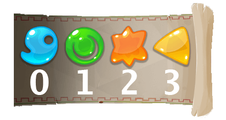

# CG 2020 Fall Challenge Postmortem

## Stats


## The challenge
<div></div>
<div></div>

## Day 1 : Wood 1&2
### My strategy
#### Wood 1 : Simple choice comparaison function
```
For the first Wood league, we got simplified rules, we have a filled inventory and two spells to do.
There is a set of simple potions to do, and our inventory is filled with some elements
```
> So I basically made a function to choose the two best potions I can do with my inventory, and that was enougth to pass Wood2.
#### Wood 2 : Scoring spells sequence
```
New rules has been added on the second league. We now have the 4 base spells available:

[ 2,  0,  0,  0], // make 2 tier0
[-1,  1,  0,  0], // make 1 tier1 from 1 tier0
[ 0, -1,  1,  0], // make 1 tier2 from 1 tier1
[ 0,  0, -1,  1]  // make 1 tier3 from 1 tier2

We can use only one spell per turn.
Every time we use a spell, we have to rest to use it again, the rest action make all the used spells usable again, but it cost a turn.
```
> Ok we now see the interesting feature of the challenge, the goal will be to arrange the inventory by using spells too have the necessary elements to make the potions. I started to imagine how to make a Graph search but actually, I guessed that it was not necessary to go to Bronze league, so I just calculated the time necessary to make every potions, choose the fastests and apply spells.
## Day 2 to 4 : Bronze
```
New rules: We can now buy differents spells from a mutual book, once a sepll learn it disapear from the book, some spells from the book are repeatable, it means they are usable several times on the same turn. To buy a spell, we have to pay a tax of tier0 elements that correspond to it's index on the list and dispose it on every book spells that are below it on the list. When you buy a spell you earn the tier0 elements that correspond to that was add to this spell if someone buy spells above it. And finally, now the two firsts orders give bonus score, the first one 3 and the second 1, theses bonus are applies only 4 times each during the game.
```
### My strategy

## Day 5 to 11 : Iron

## Day 12 : Gold
